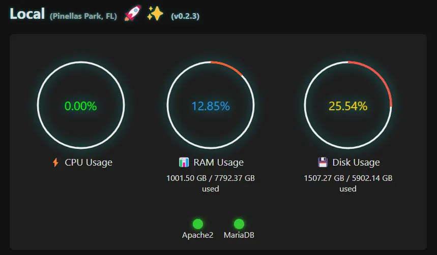
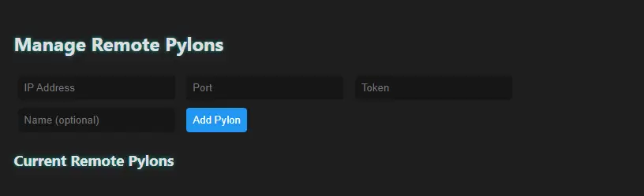
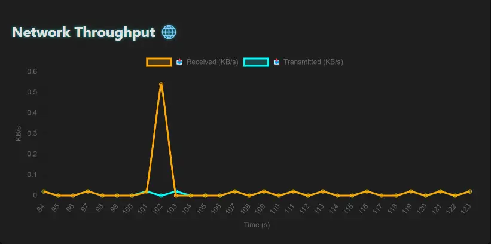
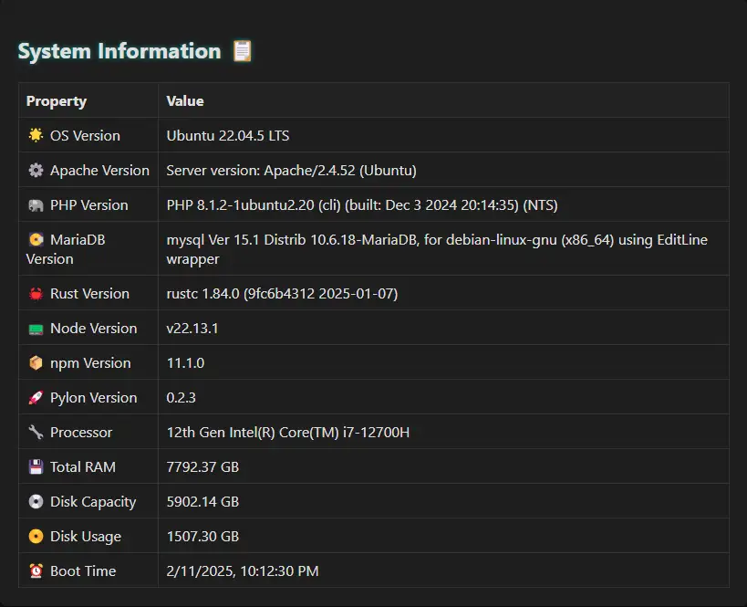
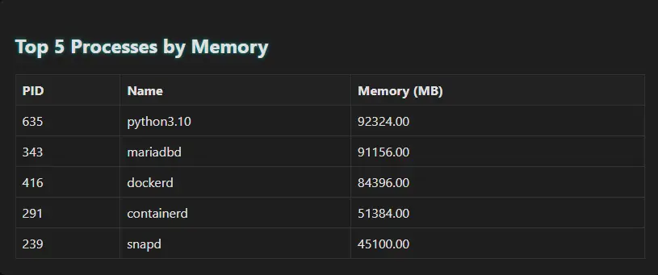

# Pylon Dashboard 🚀✨

[](LICENSE)
[](https://github.com/saintpetejackboy/pylon)
[](https://github.com/saintpetejackboy/pylon/issues)

<!-- BADGES_START -->

<!-- BADGES_END -->


[](https://github.com/saintpetejackboy/pylon/commits)
[](https://github.com/saintpetejackboy/pylon/graphs/contributors)
[](https://github.com/saintpetejackboy/pylon/network)
[](https://github.com/saintpetejackboy/pylon/stargazers)

---

- **Pylon:**  
  

---

## Table of Contents

- [Features](#features)
- [Architecture](#architecture)
- [Installation](#installation)
- [Configuration](#configuration)
- [Building & Running](#building--running)
- [API Endpoints](#api-endpoints)
- [Static Assets & Embedded Files](#static-assets--embedded-files)
- [Reverse Proxy Setup](#reverse-proxy-setup)
  - [Apache2 Example](#apache2-example)
  - [Nginx Example](#nginx-example)
- [Screenshots & Examples](#screenshots--examples)
- [Production Considerations](#production-considerations)
- [Logging and Debugging](#logging-and-debugging)
- [Development & Testing](#development--testing)
- [Advanced Deployment](#advanced-deployment)
- [Systemd Service & Auto-Update Setup](#systemd-service--auto-update-setup)
- [Contributing](#contributing)
- [Security Considerations](#security-considerations)
- [Future Roadmap](#future-roadmap)
- [License](#license)
- [Acknowledgments](#acknowledgments)

---

## Features ✨

- **Real-Time System Metrics:**  
  Monitor CPU usage, RAM, disk I/O, network throughput, load average, and view top memory-consuming processes in real time.

- **Remote Peer Discovery & Monitoring:**  
  Automatically detect and poll remote Pylon instances so you can monitor your entire network from a single dashboard.

- **Dynamic Web Dashboard:**  
  A responsive HTML/JS/CSS interface featuring animated gauges, charts, and detailed panels for both local and remote systems.

- **Admin Interface:**  
  Secure endpoints for advanced system insights and remote pylon management (e.g., adding or removing remote configurations).

- **Hot-Reload Configuration:**  
  Uses file watchers to detect changes to `config.toml` and reload settings on the fly without requiring a restart.

- **Graceful Shutdown:**  
  Asynchronous tasks and proper shutdown channels ensure a clean exit and system stability.

- **Static Binary Compilation:**  
  Option to build a fully static binary using MUSL, simplifying deployment on Linux environments.

---

## Architecture

Pylon Dashboard is organized into several key modules:

1. **Configuration Management (`config_manager.rs`)**  
   - Loads/saves settings from `config.toml` (or generates a default if missing).
   - Supports hot-reloading using file watchers.
   - Manages both local and remote pylon configurations.

2. **System Information (`system_info.rs`)**  
   - Polls local system metrics (CPU, RAM, disk, network, uptime, etc.).
   - Retrieves and caches static system details (OS version, processor info, and software versions).

3. **Remote Monitoring (`remote.rs`)**  
   - Polls remote pylons for their metrics.
   - Discovers new peer configurations from remote responses.

4. **Web Server & API (`server.rs`)**  
   - Serves the dashboard UI and embedded static assets.
   - Provides RESTful endpoints for both public metrics and admin functions.
   - Implements secure session management for admin authentication.

5. **Application Orchestration (`main.rs`)**  
   - Coordinates background tasks for configuration watching, system metric polling, and remote monitoring.
   - Listens for termination signals (e.g., Ctrl+C) to shut down gracefully.

---

## Installation

### Prerequisites

- [Rust](https://rustup.rs/) (Edition 2021 or later)
- [Cargo](https://doc.rust-lang.org/cargo/)
- A development system (Linux, macOS, or Windows). (Production deployments are typically on Linux.)
- *(Optional)* [GitHub CLI (`gh`)](https://cli.github.com/) for repository management

### Clone the Repository

```bash
git clone https://github.com/yourusername/pylon.git
cd pylon
```

---

## Configuration

Pylon Dashboard uses a TOML file (`config.toml`) to manage its settings. On the first run, if `config.toml` is missing, a default configuration (from `config_default.toml`) is generated.

### Configuration Options

- **Local Settings:**
  - `local_port` *(Optional)*: Port for the web server (default is `6989`).
  - `token`: Secret token for admin and remote API authentication.
  - `name` *(Optional)*: Display name for this Pylon instance.
  - `description` *(Optional)*: Brief description of the instance.
  - `location` *(Optional)*: Physical or logical location (e.g., "Data Center A").

- **Remote Pylons:**
  - `remote_pylons`: Array of remote configuration objects. Each contains:
    - `ip`: IP address.
    - `port`: Accessible port.
    - `token`: Authentication token.
    - `name`, `location`, `description` *(Optional)*: Additional details.

### Example `config.toml`

```toml
local_port = 6989
token = "your_secret_token"
name = "Local Pylon"
description = "Monitoring system for the primary server."
location = "Data Center A"

[[remote_pylons]]
ip = "192.168.1.10"
port = 6989
token = "remote_token_1"
name = "Remote Pylon 1"
location = "Branch Office"
description = "Backup server monitoring."
```

> **Security Note:** Add `config.toml` to your `.gitignore` to avoid committing sensitive data.

---

## Building & Running

Pylon Dashboard is built with Rust and leverages asynchronous programming with Tokio.

### Building a Static Binary with MUSL

For a portable, static Linux binary:

```bash
cargo build --release --target x86_64-unknown-linux-musl
```

The binary will be located at:

```
target/x86_64-unknown-linux-musl/release/pylon
```

### Running the Application

Simply execute the binary:

```bash
./target/x86_64-unknown-linux-musl/release/pylon
```

On startup, the application will:
- Ensure a `config.toml` exists (or create one if missing).
- Start background tasks (system metrics polling, remote monitoring, config watching).
- Launch the web server on the configured (or next available) port (default is `6989`).

Open your browser and navigate to:

```
http://127.0.0.1:<port>
```

Replace `<port>` with the actual port printed in the console.

---

## API Endpoints

Pylon Dashboard exposes several RESTful endpoints:

### Public Endpoints

- **GET /**  
  Serves the main web dashboard.

- **GET /api/metrics**  
  Returns local system metrics along with cached system information.  
  **Example Response:**
  ```json
  {
    "name": "Local Pylon",
    "description": "Monitoring system for the primary server.",
    "location": "Data Center A",
    "version": "0.2.1",
    "cached": { /* Static system info */ },
    "polled": { /* Real-time metrics */ },
    "remote_pylons": [ /* Remote pylon configurations */ ]
  }
  ```

- **GET /api/remotes**  
  Returns the current status of all remote pylons.

### Admin Endpoints

These endpoints require admin authentication using the token from your configuration.

- **POST /api/login**  
  Authenticates the admin user.  
  **Payload:**
  ```json
  { "token": "your_secret_token" }
  ```
  **Success Response:**
  ```json
  { "status": "logged in" }
  ```

- **GET /api/admin-content**  
  Returns HTML content for the admin panel *(accessible only after authentication)*.

- **GET /api/config/pylons**  
  Retrieves the list of remote pylons from the configuration.

- **POST /api/config/pylons/add**  
  Adds a new remote pylon.
  **Payload:**
  ```json
  {
    "ip": "192.168.1.11",
    "port": 6989,
    "token": "remote_token_2",
    "name": "Remote Pylon 2",
    "location": "Remote Office",
    "description": "Secondary monitoring node."
  }
  ```
  **Success Response:**
  ```json
  { "status": "added" }
  ```

- **POST /api/config/pylons/remove**  
  Removes a remote pylon.
  **Payload:**
  ```json
  { "ip": "192.168.1.11", "port": 6989 }
  ```
  **Success Response:**
  ```json
  { "status": "removed" }
  ```

---

## Static Assets & Embedded Files

All static assets (HTML, CSS, JavaScript, images, favicons, etc.) are embedded into the binary using [rust-embed](https://crates.io/crates/rust-embed). This means:
- There is no need to host a separate static folder.
- Updates to these assets require recompiling the project.
- Embedded assets include favicons and other necessary files for the dashboard.

---

## Reverse Proxy Setup

Running Pylon Dashboard behind a reverse proxy can help you serve it on a custom domain and enforce HTTPS.

### Apache2 Example

Below is a generic Apache2 reverse proxy configuration example. Save this as a site configuration file (e.g., `/etc/apache2/sites-available/your-domain.conf`):

```apache
<IfModule mod_ssl.c>
<VirtualHost *:80>
    ServerAdmin admin@example.com
    ServerName yourdomain.example.com
    RewriteEngine On
    RewriteCond %{HTTPS} off
    RewriteRule ^ https://%{HTTP_HOST}%{REQUEST_URI} [L,R=301]
</VirtualHost>

<VirtualHost *:443>
    ServerAdmin admin@example.com
    ServerName yourdomain.example.com

    ProxyPreserveHost On
    ProxyPass / http://127.0.0.1:6989/
    ProxyPassReverse / http://127.0.0.1:6989/

    ErrorLog ${APACHE_LOG_DIR}/yourdomain-error.log
    CustomLog ${APACHE_LOG_DIR}/yourdomain-access.log combined

    SSLEngine on
    SSLCertificateFile /path/to/your/fullchain.pem
    SSLCertificateKeyFile /path/to/your/privkey.pem

    Header always set Strict-Transport-Security "max-age=31536000; includeSubDomains; preload"
</VirtualHost>
</IfModule>
```

After saving, enable the site and reload Apache:
```bash
sudo a2ensite your-domain.conf
sudo systemctl reload apache2
```

### Nginx Example

For Nginx, a similar reverse proxy configuration might look like this. Save it as a server block (e.g., in `/etc/nginx/sites-available/your-domain`):

```nginx
server {
    listen 80;
    server_name yourdomain.example.com;
    return 301 https://$host$request_uri;
}

server {
    listen 443 ssl;
    server_name yourdomain.example.com;

    ssl_certificate /path/to/your/fullchain.pem;
    ssl_certificate_key /path/to/your/privkey.pem;
    include /etc/nginx/snippets/ssl-params.conf;

    location / {
        proxy_pass http://127.0.0.1:6989/;
        proxy_set_header Host $host;
        proxy_set_header X-Real-IP $remote_addr;
        proxy_set_header X-Forwarded-For $proxy_add_x_forwarded_for;
    }
}
```

Then enable the configuration and reload Nginx:
```bash
sudo ln -s /etc/nginx/sites-available/your-domain /etc/nginx/sites-enabled/
sudo systemctl reload nginx
```

*Note:* Similar principles apply to other reverse proxy services. Consult your proxy server’s documentation for specific configuration details.

---

## Screenshots & Examples

Below are some placeholder images to showcase the dashboard’s output. Replace the paths with your compressed image files (e.g., WebP format):

- **Admin Panel:**  
  

- **Network:**  
  

- **System Info:**  
  
  
- **Processes:**  
  

---

## Production Considerations

- **Session Security:**  
  The default session key in `server.rs` (`Key::from(&[0; 64])`) is insecure. Replace it with a securely generated key for production and consider serving over HTTPS.

- **Sensitive Configuration:**  
  Ensure that your `config.toml` (containing tokens and secrets) is secure and excluded from version control.

- **Reverse Proxy:**  
  Running behind a reverse proxy (as shown above) adds an extra layer of security, enabling HTTPS and custom domains.

---

## Logging and Debugging

- **Logging Middleware:**  
  Pylon Dashboard uses Actix Web’s built-in logging (`Logger::default()`).

- **Verbose Logging:**  
  Set the environment variable for detailed logs:
  ```bash
  export RUST_LOG=actix_web=debug
  ```
  Then run the application normally.

---

## Development & Testing

- **Running in Development Mode:**  
  For rapid development iterations, use:
  ```bash
  cargo run
  ```
  This avoids building a static MUSL binary.

- **Testing API Endpoints:**  
  Use tools like `curl` to test endpoints:
  ```bash
  # Test local metrics endpoint
  curl http://127.0.0.1:6989/api/metrics

  # Test admin login (replace with your token)
  curl -X POST -H "Content-Type: application/json" \
       -d '{"token": "your_secret_token"}' \
       http://127.0.0.1:6989/api/login
  ```

- **Automated Tests:**  
  If tests are added in the future, run them with:
  ```bash
  cargo test
  ```

- **Hot-Reload Configuration:**  
  The [notify](https://crates.io/crates/notify) crate watches for changes in `config.toml` and reloads settings automatically.

---

## Advanced Deployment: Systemd Service & Auto-Update Setup

Pylon Dashboard supports automatic in-place updates and runs as a systemd service. Follow these steps to configure your environment:

### 1. Secure Binary Installation

```bash
sudo mkdir -p /opt/pylon
sudo chown -R www-data:www-data /opt/pylon
sudo chmod -R 755 /opt/pylon
```

Deploy your built binary into `/opt/pylon`:

```bash
cp target/x86_64-unknown-linux-musl/release/pylon /opt/pylon/
sudo chmod +x /opt/pylon/pylon
```

### 2. Setup Helper Shell Script

A helper shell script (`setup-pylon.sh`) is provided to create the necessary directories, configure a wrapper script, set up a systemd service, and grant the `www-data` user passwordless sudo access for service management.

Place the following script in your project root (it is included on github as well):

```bash
#!/bin/bash
# setup-pylon.sh
#
# This script sets up /opt/pylon, creates the systemd service,
# and configures sudoers for auto-update functionality.

# Ensure the script is run as root.
if [ "$(id -u)" -ne 0 ]; then
    echo "Run as root or with sudo."
    exit 1
fi

set -e

echo "Creating /opt/pylon directory..."
mkdir -p /opt/pylon
chown www-data:www-data /opt/pylon
chmod 775 /opt/pylon

echo "Writing the wrapper script /opt/pylon/start-pylon.sh..."
cat > /opt/pylon/start-pylon.sh << 'EOF'
#!/bin/bash
# Wait until the binary is executable, then execute it.
while [ ! -x /opt/pylon/pylon ]; do
  echo "Waiting for /opt/pylon/pylon to be executable..."
  sleep 1
done
exec /opt/pylon/pylon
EOF
chmod +x /opt/pylon/start-pylon.sh

echo "Writing the systemd service file /etc/systemd/system/pylon.service..."
cat > /etc/systemd/system/pylon.service << 'EOF'
[Unit]
Description=Pylon Dashboard Service
After=network.target

[Service]
ExecStart=/opt/pylon/start-pylon.sh
User=www-data
Group=www-data
WorkingDirectory=/opt/pylon
Environment=RUST_LOG=actix_web=info
Restart=always
RestartSec=2

[Install]
WantedBy=multi-user.target
EOF

echo "Creating sudoers drop-in for www-data to manage the pylon service..."
cat > /etc/sudoers.d/pylon << 'EOF'
www-data ALL=(root) NOPASSWD: /usr/bin/systemctl restart pylon, /usr/bin/systemctl start pylon, /usr/bin/systemctl stop pylon
EOF
chmod 0440 /etc/sudoers.d/pylon

echo "Reloading systemd daemon..."
systemctl daemon-reload

echo "Enabling and starting the Pylon service..."
systemctl enable --now pylon.service

echo "Setup complete. The Pylon service is active and waiting for /opt/pylon/pylon to become executable."
```

Make the script executable and run it as root:

```bash
sudo chmod +x setup-pylon.sh
sudo ./setup-pylon.sh
```

### 3. Auto-Update Behavior

The auto-update mechanism downloads a new binary, writes it to the same directory as the current binary (avoiding cross-device link errors), backs up the current binary as `pylon.old`, replaces it, and restarts the service using `sudo systemctl restart pylon`.

Monitor auto-update logs with:

```bash
sudo journalctl -u pylon.service -f
```

---

## Contributing 🤝

Whether you're fixing bugs, adding features, or improving documentation, your help is appreciated. Please feel free to fork the repository and submit pull requests.

---

## Security Considerations

- **Configuration Files:**  
  The `config.toml` file contains sensitive data (tokens, secrets). Ensure it is excluded from version control and secured.
- **Admin Token:**  
  Use a strong, unique token for admin authentication.
- **Session Management:**  
  Update the default session key for production use and consider HTTPS to protect session cookies.
- **Auto-Update Privileges:**  
  The auto-update mechanism requires the service user to restart the service via sudo. Ensure proper sudoers rules are in place to avoid unauthorized access.

---

## Future Roadmap

- **Enhanced UI/UX:**  
  Further improvements to design, mobile responsiveness, and alternative skins.
- **Extended Monitoring:**  
  Integration of additional system metrics and configurable options.
- **Advanced User Management:**  
  More robust authentication and user management features.
- **Cross-Platform Support:**  
  Currently optimized for Linux; future enhancements may extend to other platforms.
- **Containerization:**  
  Official Docker support and further containerization improvements.

---

## License

This project is licensed under the [MIT License](LICENSE).

---

## Acknowledgments

- Built using the powerful Rust ecosystem (including [Tokio](https://tokio.rs/), [Actix Web](https://actix.rs/), and [sysinfo](https://crates.io/crates/sysinfo)).
- Inspired by classic system monitoring tools and modern dashboard interfaces.
- Thanks to the open-source community for ongoing support and contributions.

---

Happy monitoring—and may your pylons always be online! 🌟
